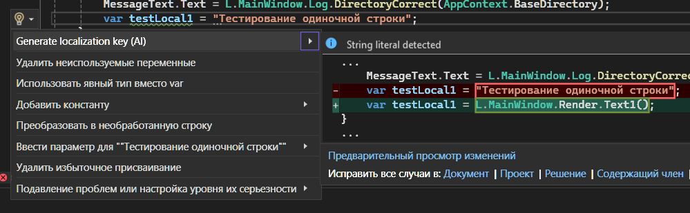
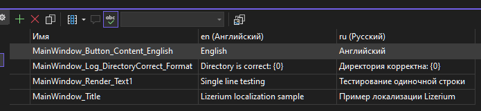
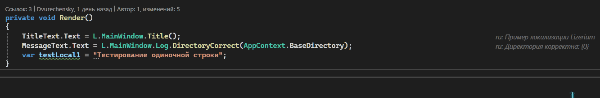
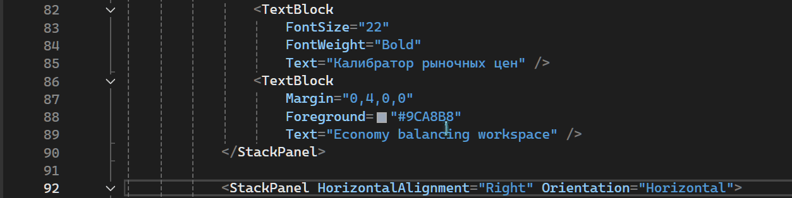
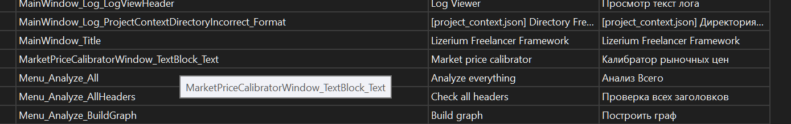

<h1 align="center">Lizerium.Localization.Toolkit</h1>

<p align="center">
    
    
    
    
    
</p>
<p align="center">
    <a href="https://marketplace.visualstudio.com/items?itemName=dvurechensky.lizerium-localization-xaml-tools">
      
    </a>
</p>

<p align="center">
  <strong>Язык:</strong>
  Русский |
  <a href="./README.md">English</a>
</p>

`Lizerium.Localization.Toolkit` - набор инструментов для локализации .NET/WPF проектов на `.resx`: runtime, source generator, analyzer, CodeFix, AI-генерация переводов, подсказки редактора C#, XAML VSIX и WPF редактор ресурсов.

## Возможности

1. Автогенерация файлов ресурсов и ключей доступа к ним
   - 
   - 
2. Автоподсказка в реальном времени заданных значений для ключей
   - 
3. Автоперевод XAML
   - 
   - 

## Установка

```xml
<PackageReference Include="Lizerium.Localization.Toolkit" Version="1.0.0" />
```

## Что входит

| Пакет                                    | Назначение                                                 |
| ---------------------------------------- | ---------------------------------------------------------- |
| `Lizerium.Localization.Toolkit`          | All-in-one пакет: runtime, generator, analyzer, AI CodeFix |
| `Lizerium.Localization.Core`             | Runtime `.resx`, `LocalizationService`, WPF `{loc:Loc}`    |
| `Lizerium.Localization.Generator`        | Source generator для `Generated.Localization.Localization` |
| `Lizerium.Localization.Analyzer`         | Проверка отсутствующих ключей и CodeFix                    |
| `Lizerium.Localization.Ai.Analyzer`      | AI CodeFix для C# строк и interpolated strings             |
| `Lizerium.AI.LocalizationAssistant.Core` | Конфигурируемое AI ядро для Ollama/LibreTranslate          |
| `Lizerium.Localization.Xaml.Vsix`        | Лампочка Visual Studio для WPF XAML                        |
| `Lizerium.Localization.EditorHints`      | Inline-подсказки Visual Studio для C# вызовов локализации  |
| `Lizerium.Localization.GUI`              | WPF редактор `.resx` переводов                             |

## Настройка проекта

```text
Resources/
  Localization/
    Strings.en.resx
    Strings.ru.resx
```

```xml
<ItemGroup>
  <AdditionalFiles Include="Resources\Localization\*.resx" />
  <Content Include="Resources\Localization\*.resx">
    <CopyToOutputDirectory>PreserveNewest</CopyToOutputDirectory>
  </Content>
</ItemGroup>
```

## Runtime

```csharp
using Lizerium.Localization.Core;
using L = Generated.Localization.Localization;

LocalizationService.Instance.Configure(
    Path.Combine(AppContext.BaseDirectory, "Resources", "Localization"));

LocalizationService.Instance.ChangeLanguage("ru");

var title = L.MainWindow.Title();
```

## AI локализация C# строк

Analyzer предлагает CodeFix на обычных строках и interpolated strings:

```csharp
var title = "Hello World";
var details = $"Log directory: {AppContext.BaseDirectory} | {5}";
```

Для NuGet analyzer настройки AI задаются переменными окружения до запуска Visual Studio:

```text
LIZERIUM_OLLAMA_URL=http://localhost:11434
LIZERIUM_OLLAMA_MODEL=qwen2.5:7b
LIZERIUM_OLLAMA_GENERATE_ENDPOINT=/api/generate
LIZERIUM_LIBRETRANSLATE_URL=http://localhost:5000
LIZERIUM_AI_TIMEOUT_SECONDS=30
```

Если Ollama работает на `http://localhost:11434`, можно оставить значения по умолчанию.

## XAML локализация

Для runtime XAML:

```xml
xmlns:loc="clr-namespace:Lizerium.Localization.Core;assembly=Lizerium.Localization.Core"
```

```xml
<Button Content="{loc:Loc MainWindow_Button_English}" />
```

Для лампочки Visual Studio установите VSIX:

```text
src\Lizerium.Localization.Xaml.Vsix\bin\Release\net472\Lizerium.Localization.Xaml.Vsix.vsix
```

Настройки AI для VSIX находятся здесь:

```text
Tools -> Options -> Lizerium Localization -> AI Servers
```

## C# inline-подсказки

`Lizerium.Localization.EditorHints` показывает inline-подсказки в редакторе Visual Studio 2022 рядом с вызовами сгенерированной локализации, например:

```csharp
var title = L.MainWindow.Title();
```

Текст подсказки берётся из соответствующего значения `.resx`. Расширение использует язык интерфейса Visual Studio, если значение найдено, и иначе показывает английский текст.

Установите собранный VSIX:

```text
src\Lizerium.Localization.EditorHints\bin\Release\net472\Lizerium.Localization.EditorHints.1.0.4.vsix
```

Диагностика пишется в `%TEMP%/Lizerium.Localization.EditorHints.log`.

## Документация и сайт

- Markdown docs: [`docs/README.ru.md`](docs/README.ru.md)
- GitHub Pages entry: [`docs/index.html`](docs/index.html)
- Русская страница сайта: [`docs/ru/index.html`](docs/ru/index.html)

## Сборка

```powershell
dotnet build Lizerium.Localization.Toolkit.sln -c Release
dotnet test Lizerium.Localization.Toolkit.sln -c Release --no-build
```
